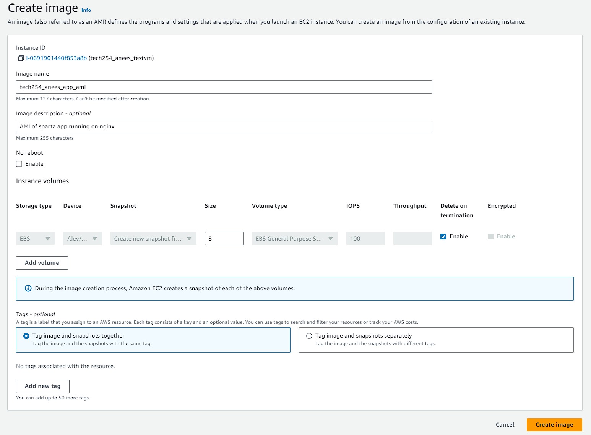

first stop the app ' CONTROL + C'

Go to instance on AWS

Actions -> Image and templates -> Create image

Create image is a snapshot

Create template is the configurations

Create an image - Enter details, leave gb at 8.

Create a new instance, go to "MY AMIs".
Go to owned by me
Drop down - > search for the one i made.

Do rest of instance set up as same.

### Why ami

Stable

Copy to diff regions on aws

Faster to launch

Security and compliance - make sure everything is same - > complies with regulations

Autoscaling - Easily make x amount of instances from a specific AMI

### Why script

More flexible - change node js version for example

Automation - easier to automate

Cost control - it costs money to store amis

Dyanamic reqs - you can make custom script for certain requirements

Version control - easier to do with script

We use scripts and ami together. AMI as a base, script to customize even further.