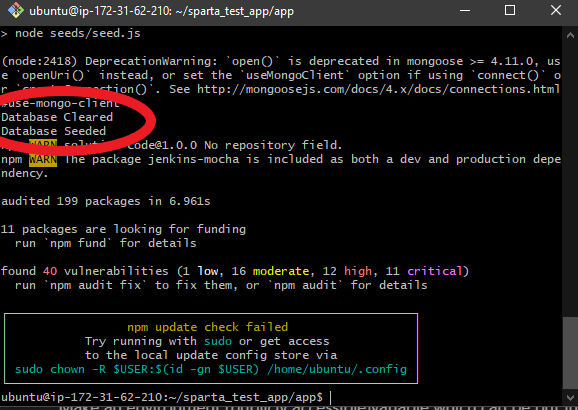

# Setting up and connecting to a mongodb

Firstly, set up app ec2 instance with a previously created AMI and connect to it via ssh.

## Database set up
Now we need to create an instance in which we will host our database.

Create a database using the same naming conventions, ubuntu version and t.2 micro. The only real change is in the security rules

Add an additional inbound rule like the following. 
 The only port we need is the port mongodb runs on

 


  Save the security group, so we can reuse it later, and launch the instance. 
  
  Open separate a gitbash terminal and connect to the new database instance using SSH

 Once you're in, run the update and upgrade commands. These will ensure you have the latest versions of the packages.

 `sudo apt update`

 `sudo apt upgrade -y`

 Acquire the key to mongodb version 3.2. This will assign the key to sudo apt, which we will use later.

 ```wget -qO - https://www.mongodb.org/static/pgp/server-3.2.asc | sudo apt-key add -```

If successful, it should return OK.

Verifying the key - we need to make sure it works and is pointing to the right version of mongo

```echo "deb http://repo.mongodb.org/apt/ubuntu xenial/mongodb-org/3.2 multiverse" | sudo tee /etc/apt/sources.list.d/mongodb-org-3.2.list```

Now we must download mongodb, using the key we assigned to sudo apt key. It will now look for the new packages we asked for it to get.

`$ sudo apt update`

To install, we will use the following command. We need to be specific about which packages we want to install.

`sudo apt-get install -y mongodb-org=3.2.20 mongodb-org-server=3.2.20 mongodb-org-shell=3.2.20 mongodb-org-mongos=3.2.20 mongodb-org-tools=3.2.20`

Mongdob has a config setting file which allows who can connect, and can be found:

`sudo nano /etc/mongod.conf`

Go to network interfaces

`bindIp` specifies what ip can connect to mongdob.

Currently it is local host, so by default only system hosting it can access. Change it 0.0.0.0 to allow everyone to connect


Exit and save the file, take extra care to not accidentally rename it.

W can now start mongo using:

`sudo systemctl start mongod`

Enable will allow mongodb to auto start every time we load up this instance, so we don't need to use start again

`sudo systemctl enable mongod`

Ensure everything is running as it should be:

`sudo systemctl status mongod`

If you see `active(running)` everything is working as expected.

## Connect app to database

We now need to connect our app instance to our database instance. 

Go back to app terminal.

Make an environment (publicly accessible)  variable which we will use to pass through our public ip address **for the database**. Create the variable as shown below and paste in your public IP

`export DB_HOST=mongodb://34.244.3.111:27017/posts
`

Verify the variable has been created correctly using:

`printenv DB_HOST`

Navigate to app folder

`npm install`

If you see "Database Cleared" and "Database Seeded" everything is working as expected




Use `node app.js` to launch the application.

In your web browser go to the public ip followed by :3000 (the port) and `/posts` (to display the information from the database) An example is:
`http://54.154.138.24:3000/posts`

If you see a bunch of randomly generated latin posts, you have successfully set up the connection!
