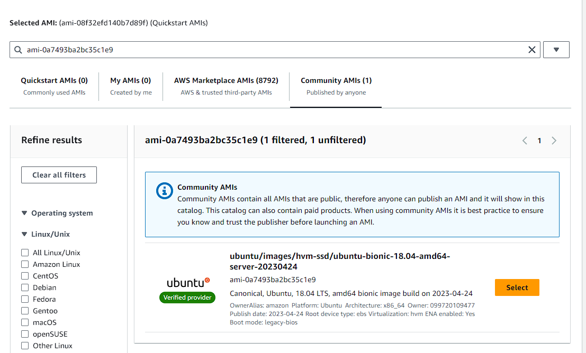
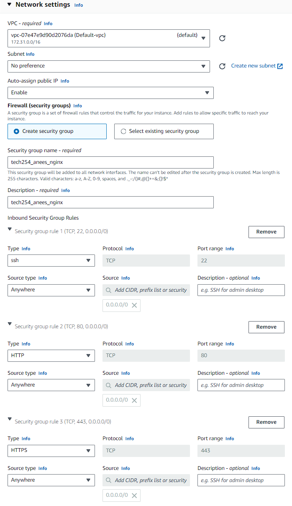
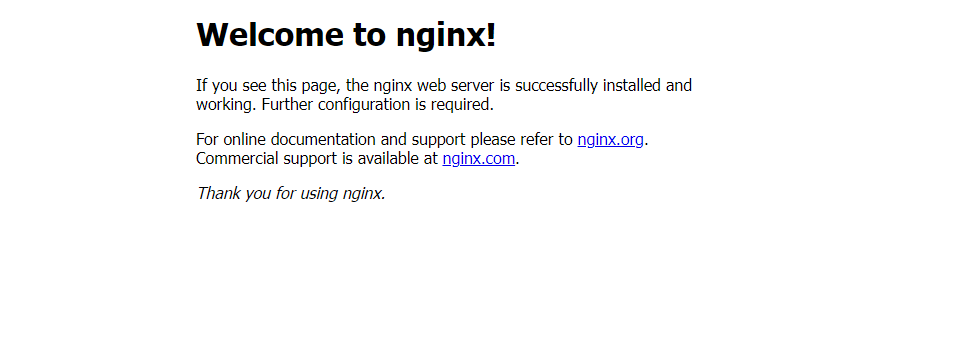

# Creating a new EC2 instance

First we have to set up our EC2 instance. To do this log in with your details. Once logged in, using the search bar at the top, search for EC2 and click on the first link.

Once you have entered the EC2 page, click on the bright orange button that says "Launch instance", and you should see the following:

We can use this page to set up our instance. We begin by naming out instance, and in this case we use "tech254_anees_nginx"

Next is the AMI. This is the template that contains the software configuration, such as the OS we are going to use, required to launch the instance. Select browse AMIs, then select the community AMIs tab. Here search for "ami-0a7493ba2bc35c1e9" and select the AMI that is found

For instance type, we leave this as default, the "t2.micro" instance type provides us with what we need

For key pair login, select the dropdown menu and scroll down and select tech 254

## Network settings

In the top right, select edit settings.
The first three settings, VPC, subnet and auto-assign public ip we leave that as default

Select create security group, and name the group. 

Now onto the more important part: Inbound Security Group Rules. It is vital you add two additional security group rules, changing one of them to HTTP and the other to HTTPS. Change each type of source type to anywhere. This will allow us to connect to the instance we create from anywhere. Network settings should now look like:

Leave the configure storage as default and press launch instance!

# SSH in and setup/deploy nginx

Now that the instance has been successfully created, we now need to connect to it and deploy nginx.
First, download the tech254.pem file and place it in your .ssh folder. Continently, if you navigate to your created instance on AWS, and click on the connect tab, AWS provides the instructions you need to connect via SSH:

Follow the instructions given, and you should be able to connect to the instance. Once you have connected, run the following commands to gather updates, install them, install nginx and deploy nginx.

To get the updates and upgrade to them use `sudo apt update` followed by `sudo apt upgrade -y`, with the `-y` used to automatically confirm you want to install them all.

Then to install nginx use `sudo apt install nginx -y` followed by `sudo systemctl start nginx` to start and deploy nginx.

If you have followed these steps correctly, you can now visit the public ip address, as listed on your AWS instance page, and be greeted by the following: 

## Nginx

Nginx is a popular open-source web server software known for its high performance and scalability. It is commonly used to serve web pages, applications, and content on the internet. Nginx can also function as a reverse proxy server and load balancer, making it a versatile tool for managing web traffic.

### Key Features of Nginx:

- Efficient handling of concurrent connections.
- Excellent for serving static content and as a reverse proxy for dynamic content.
- Supports SSL/TLS encryption for secure communication.
- Configuration flexibility through a declarative language.

## Web Server

A web server is a software application or hardware device that processes incoming requests from clients (usually web browsers) and delivers web content in response. Its primary functions include:

- Accepting incoming HTTP requests.
- Locating and retrieving requested files or generating dynamic content.
- Sending the content back to the requesting client.

Web servers play a crucial role in making websites and web applications accessible over the internet. They are the foundation of the World Wide Web, handling the transmission of web pages, images, videos, and other resources to users' devices.
