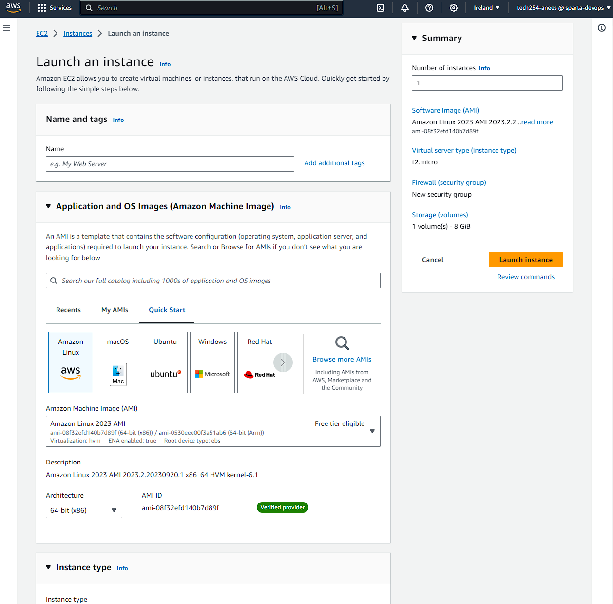
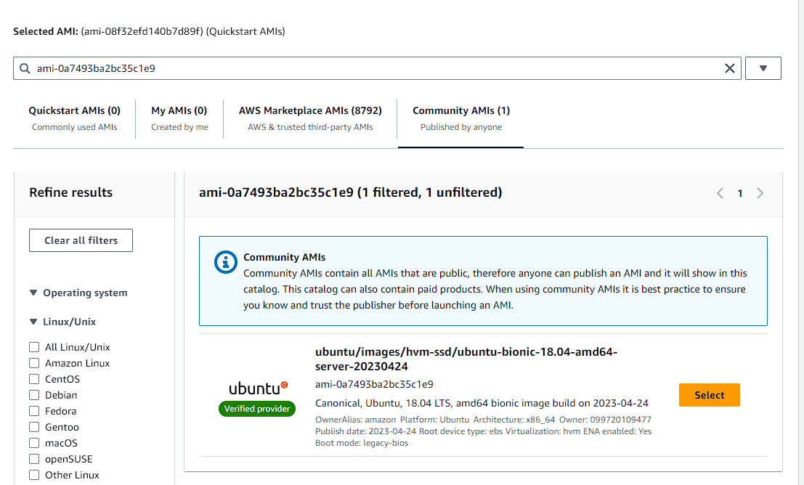
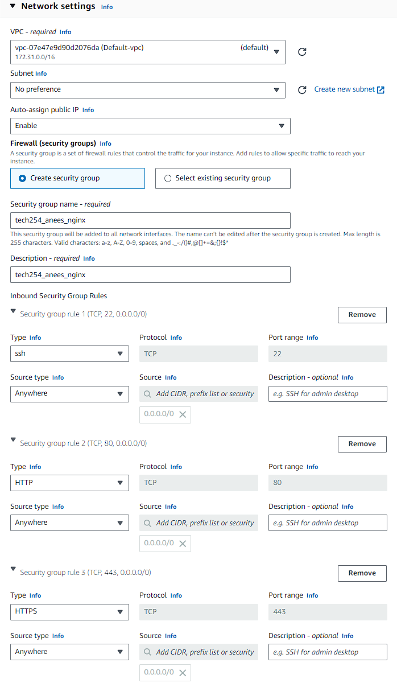
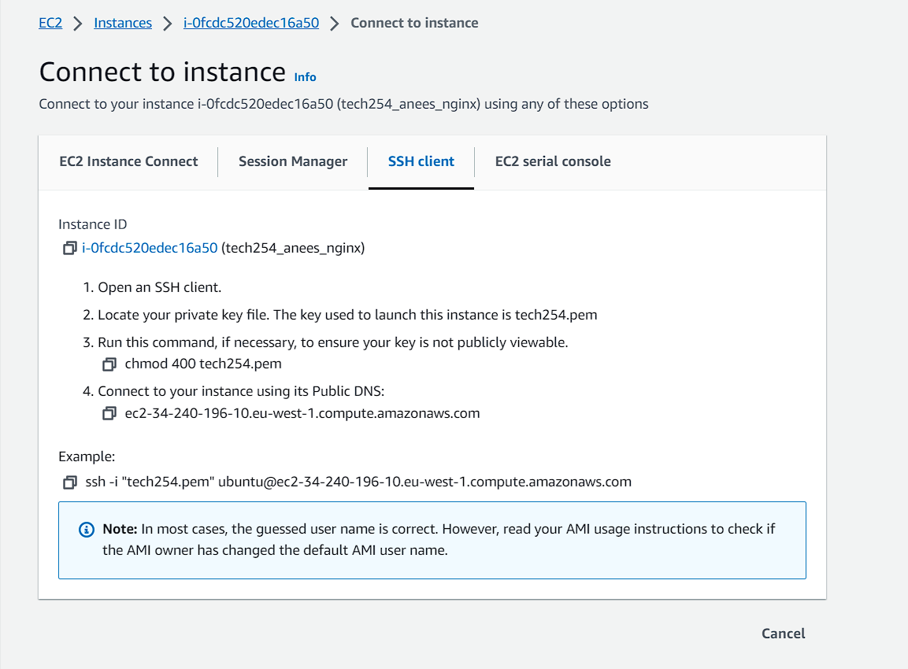
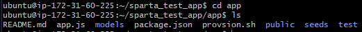
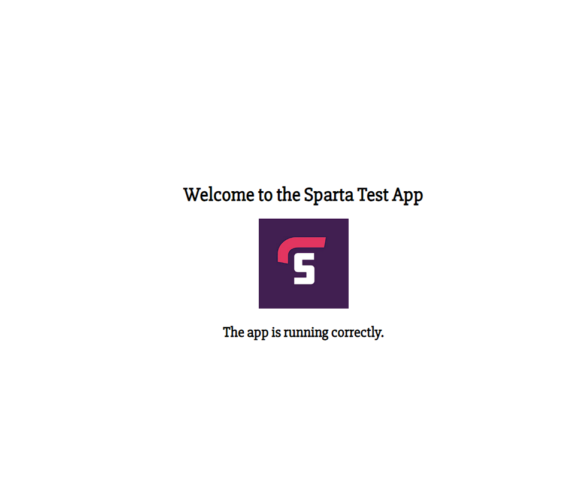

# Creating a new EC2 instance

First we have to set up our EC2 instance. To do this log in with your details. Once logged in, using the search bar at the top, search for EC2 and click on the first link.

Once you have entered the EC2 page, click on the bright orange button that says "Launch instance", and you should see the following:

We can use this page to set up our instance. We begin by naming out instance, and in this case we use "tech254_anees_nginx"

Next is the AMI. This is the template that contains the software configuration, such as the OS we are going to use, required to launch the instance. Select browse AMIs, then select the community AMIs tab. Here search for "ami-0a7493ba2bc35c1e9" and select the AMI that is found

For instance type, we leave this as default, the "t2.micro" instance type provides us with what we need

For key pair login, select the dropdown menu and scroll down and select tech 254

## Network settings

In the top right, select edit settings.
The first three settings, VPC, subnet and auto-assign public ip we leave that as default

Select create security group, and name the group. 

Now onto the more important part: Inbound Security Group Rules. It is vital you add three additional security group rules, changing one of them to HTTP, the other to HTTPS and the last one to a custsom TCP with a port range of 3000. Change each type of source type to anywhere. This will allow us to connect to the instance we create from anywhere. The custom tcp will help us further down the line when we deploy with nodejs. Network settings should now look like:

Leave the configure storage as default and press launch instance!

# SSH in and setup/deploy nginx

Now that the instance has been successfully created, we now need to connect to it and deploy nginx.
First, download the tech254.pem file and place it in your .ssh folder. Continently, if you navigate to your created instance on AWS, and click on the connect tab, AWS provides the instructions you need to connect via SSH:

Follow the instructions given, and you should be able to connect to the instance. Once you have connected, run the following commands to gather updates, install them, install nginx and deploy nginx.

To assist us in the future with automation, we will create a script that contains all the following commands needed, so we never have to do this step again.

`nano provision.sh` - Create shell script we will use, and open in nano text editor.

`#!/bin/bash` - Place at top of file. Tell linux which interpreter to use.

`systemctl restart` first stops the service and then starts it again, and it will also start it if it was not already running.

`enable` - When OS boots, starts process. Means if we suspend and comeback it will be there.

 
 Once you have saved a shell script like the one above use `sudo chmod +x provision.sh`, this makes the script an executable.

`./provision.sh` - Run the script once it has been made a executable.

If you have followed these steps correctly, you can now visit the public ip address, as listed on your AWS instance page, and be greeted by the following: 

## Deploying a nodejs app

First, we need to clone the app to our instance. The quickest way to achieve this is using github clone. While in the home directory (ideally), enter the following command `git clone https://github.com/LSF970/sparta_test_app.git`.

If done successfully, use ls to check, cd into the app folder. Once to make sure everything is right, after using ls you should see the following:

### Setting up Nodejs
Due to the app being quite old, we need to install a specific version of nodejs, version 12 to be exact

Use `curl -sL https://deb.nodesource.com/setup_12.x | sudo -E bash -` to get version 12 of nodejs.

Once we have done that, we can install that version using `sudo apt install nodejs -y` 

Next we use the command `sudo npm install pm2 -g`. For reference, NPM = Node package manager and PM2 is a manager for node processes. These are vital packages when using and deploying nodejs applications.

## Deploying
Now finally we must deploy our app, and this part is quite simple. We use the following two commands:
`npm install` - Bundle up for everything for nodejs

`node app.js` - Starts/Deploys the app.

If all went well, add a ":3000" on the end of your url, as this is where the app was deployed to, and you should see the following:

