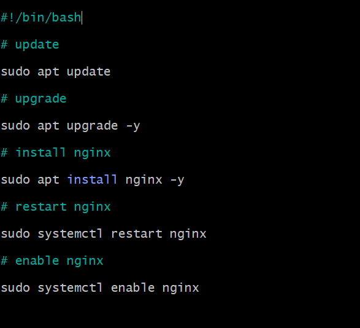

`cd ..` - Go to parent folder. `cd .` is current folder

`mv chicken-joke.txt bad-joke.txt` - Renames to bad-joke.txt

## Creating a script to install nginx

`nano provision.sh` - Create shell script we will use, and open in nano text editor.

`#!/bin/bash` - Place at top of file. Tell linux which interpreter to use.

`systemctl restart` first stops the service and then starts it again, and it will also start it if it was not already running.

`enable` - When OS boots, starts process. Means if we suspend and comeback it will be there.

`sudo chmod +x provision.sh` - +x makes file executable.

`./provision.sh` - Run the script once it has been made a executable.

`sudo systemctl status nginx` - We can check the status of nginx

## Managing processes

`ps` - Shows USERS processes, the ones we have started in the current session.

**PID** - Process ID, unique identifier

**TTY** - Terminal session that it is running within

`ps --help simple` - Will list all flags to use with the ps command

`ps -A` - Shows ALL processes.

`ps aux` - Shows all the information alongside all the processes.

`top` - Live readout of processes that are running. SHIFT + M sorts by memory. SHIFT + N shows newest. SHIFT + P sorts by cpu usage. Press Q to exit.

`sleep 5` - Dummy program that runs in foreground. You cant interact with CLI until time has elapsed

`sleep 5000 &` - Runs in background

`kill` - Used to end a process. 64 signals. -1 is the first signal (is the most "gentle"). -15 "terminates" (more forceful). -9 returns killed (the most forceful).

## Permissions
`ls -l` - Used to view permissions
Three sets of permissions:
* **Owner** - Creator of file/folder
* **Group** - Users within systems
* **Others** - Everyone else 

Three types of access:
* Read access 
* Write access
* Execute access

### Long hand

`chmod [permissions] [file]` - `chmod g+w filename` adds writing permission for group. Might have to add `sudo` to the start. `g` for group and `o` for users. If no group is stated, all groups are given permission

### Short hand

`sudo chmod 777 filename` - gives all permissions to all sets of users. Each 7 gives all permissions to each user set, so one 7 gives to owners only and and the second 7 gives to group.

Read is 4. Write is 2. Execute is 1.
https://chmod-calculator.com/

## Environment variables

Environment variables are dynamic variables used by a shell and its child processes. 

`printenv` - Prints environment variables

`printenv USER` - prints the user environment variable

`export MYNAME=Anees` - Declares an environment variable

