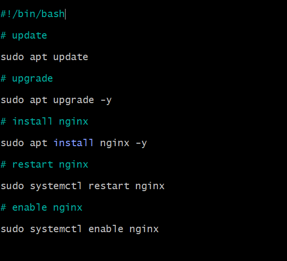

`cd ..` - Go to parent folder. `cd .` is current folder

`mv chicken-joke.txt bad-joke.txt` - Renames to bad-joke.txt

## Creating a script to install nginx

`nano provision.sh` - Create shell script we will use, and open in nano text editor.

`#!/bin/bash` - Place at top of file. Tell linux which interpreter to use.

`systemctl restart` first stops the service and then starts it again, and it will also start it if it was not already running.

`enable` - When OS boots, starts process. Means if we suspend and comeback it will be there.

`sudo chmod +x provision.sh` - +x makes file executable.

`./provision.sh` - Run the script once it has been made a executable.

`sudo systemctl status nginx` - We can check the status of nginx