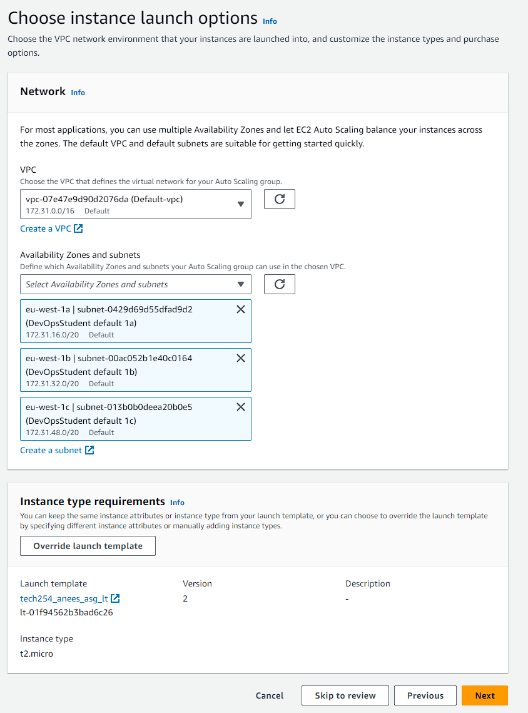

# Setting up an Auto Scaling Group

In the EC2 sidebar, scroll down and select Auto Scaling groups.

### Choose launch template 

Enter a name for the ASG, ideally using naming conventions throughout. Choose the select an existing template, and use the one we have previously created

### Launch instance options

Next we have to choose our availability zones, these are the zones that our different VMs will be hosted on within the region of ireland. Make sure to choose the options labeled "DevOpsStudent default"

### Configure advanced options

Create a new load balancer. Select application load balancer as we are using http, and also select internet facing so that the load balancer can receive traffic from the internet

Next create a target group as shown, this tells the load balancer what vm it needs to target.

Load balancer needs to know what to listen to and where to route traffic to.

Also make sure to turn on elastic load health check

### Configure group size and scaling policies

For our current situation, change min and desired to 2 and max to 3. This will specify the specific amounts of VMs we want.

Create scaling policy and for now we will use the default. This details what needs to happen in order for the auto scale to happen.

### Add tags

Use the tag we created when we created launch instance. This allows us to search by tags, and also see what instances are created by ASG

##' Load balancer

On left hand side, go to load balancer, go to your newly created load balance. Copy the dns and enter it into the url bar. Here we can see our loadbalanced app.

# Worse to better in terms of preventing disaster

In preventing disaster, there are 4 different levels of varying responses

### Doing nothing

CPU load too high --> falls over

This is the worst as no recovery procedure is in place so the entire system will fail

### Dashboard

CW monitor (cpu load) --> dashboard --> problem ( miss it)

A dashboard is set up, but no additional support is in place. Also user error may lead to missing the notification

### Alarm

CW monitor (cpu load) --> alarm -- > notification

An alarm system is set up and users will receive a email notification if cpu usage has exceeded the set amount.

### Auto scaling

CW monitor (cpu load) --> Autoscaling.

If cpu utilization exceeds 50%, additional VMs will be created. This is the best case scenario, as we are managing the excess load and the system will not collapse.

#### Additional notes:

Launch template - used to create extra instance by auto scaling

Launch template contains the configurations for the entire instance.

Auto scaling group is dictated by group size. So we can set min 2, and a desired number and a maximum.

Auto scaling group creates the additional VMs

Each vm will be in its own availability zone. Each region has its own amount of availability zones.
In ireland:

* AZ 1a 
* AZ 1b 
* AZ 1c

Scaling policy - The thresholds that need to be reached ( cpu usage > 50%)

Load balancer - dictates where traffic ends up - if one AZ is overloaded, send user to other. Load balancer receive all traffic from internet