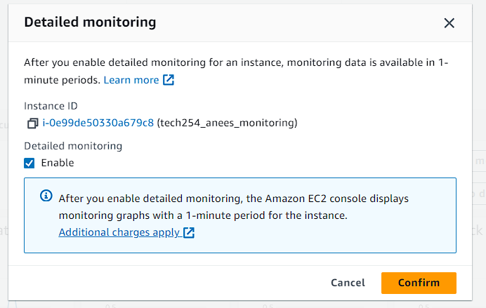
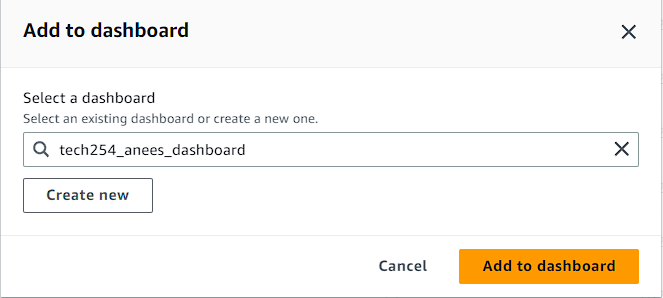
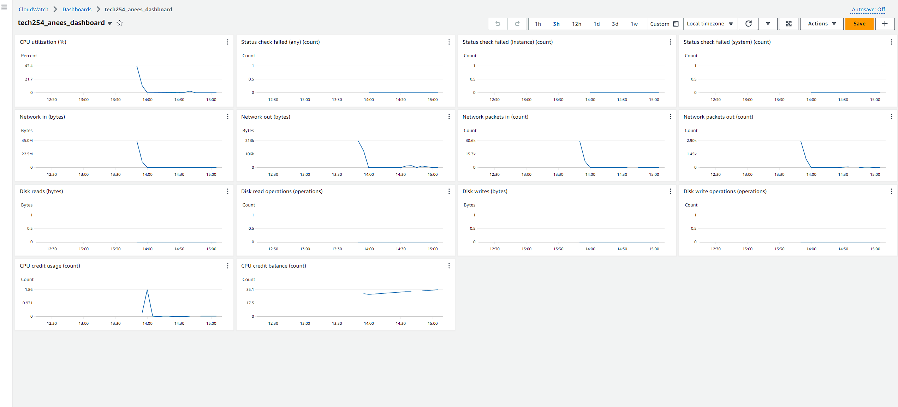
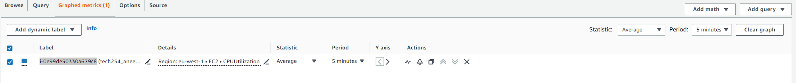
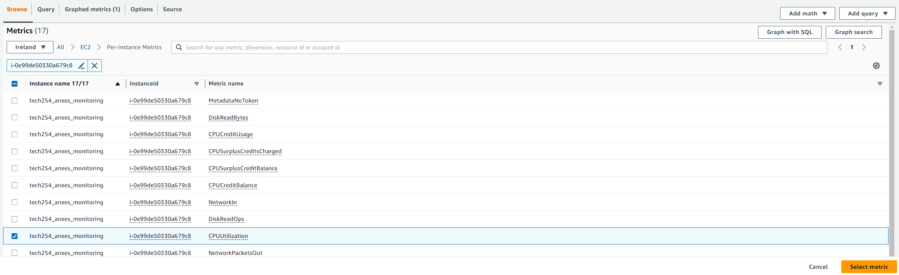
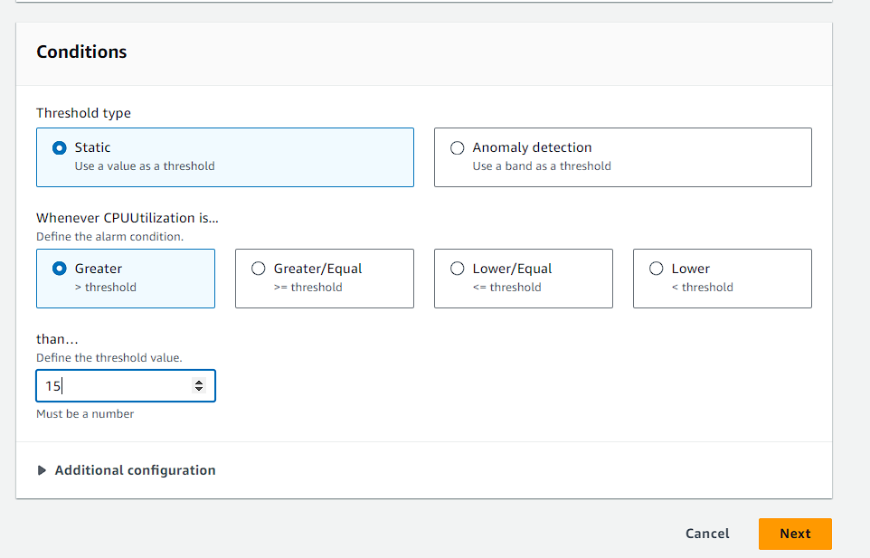
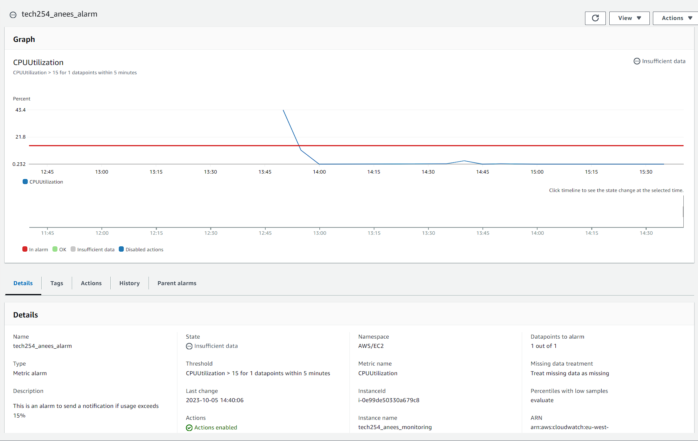

## Creating a dashboard

In the instance you have created, scroll down to find the monitoring tab

Click on the tab, and select manage deatiled monitoring. In here we want to enable detailed monitoring so we can get monitoring data in smaller time periods:

Once we have enabled monitoring we now need to add the charts to our dashboard. Select add to dashboard and a new window will open.

In here click Create new and enter a name for a new dashboard, then hit create. Now a dashboard has been created, it will be automatically selected and all we have to do is select add to dashboard.

We have now succesfully set up a dashboard where we can monitor various metrics of our instance

## CPU Usage alarm

While on the dashboard, select the three dots that appear by the CPU utilization chart and press view in metrics.  You should see a label, copy the label as we will use this for our alarm

On the left side panel ( you may need to press on the three lines) choose Alarms, then all alarms.

Press create alarm. Select metric and enter the label id in the search coloumn. Find and select the cpu utilisation

Now we must set up the thresholds. Enter what you wish but i will set it as the following

Next we need to create a new topic. This will store the data about where the notification will be sent to. Once you have created the topic , it is automatically selected. On the next page we will be asked to give the alarm a name and description, and after that the alarm will be created.

We have now created an alarm that will notfiy us if the CPU usage exceeds 15%:

