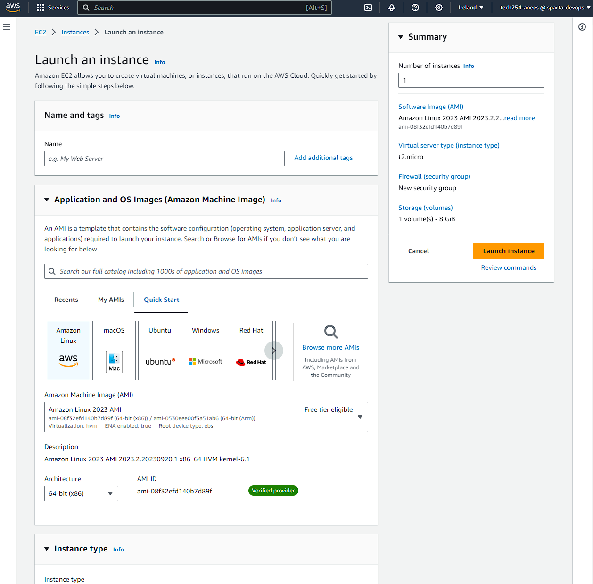

# Creating a new EC2 instance

First we have to set up our EC2 instance. To do this log in with your details. Once logged in, using the search bar at the top, search for EC2 and click on the first link.

Once you have entered the EC2 page, click on the bright orange button that says "Launch instance", and you should see the following:

We can use this page to set up our instance. We begin by naming out instance, and in this case we use "tech254_anees_nginx"

Next is the AMI. This is the template that contains the software configuration, such as the OS we are going to use, required to launch the instance. Select browse AMIs, then select the community AMIs tab. Here search for "ami-0a7493ba2bc35c1e9" and select the AMI that is found

For instance type, we leave this as default, the "t2.micro" instance type provides us with what we need

For key pair login, select the dropdown menu and scroll down and select tech 254

## Network settings

In the top right, select edit settings.