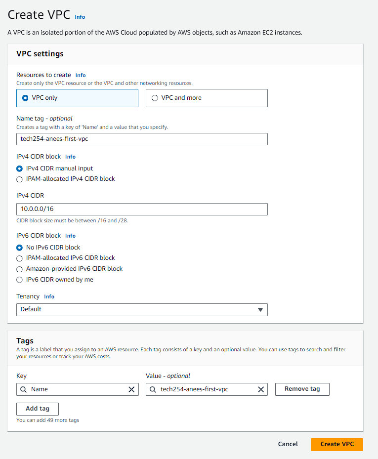
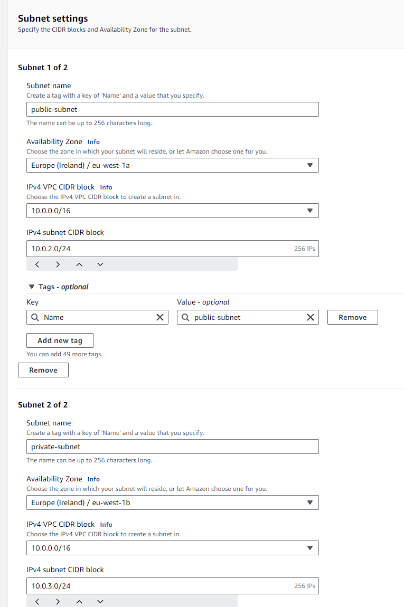
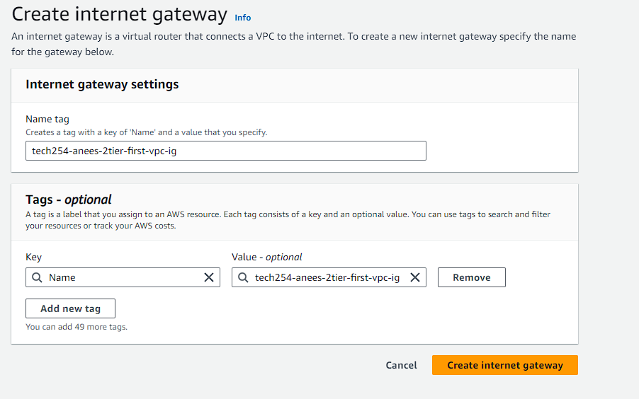
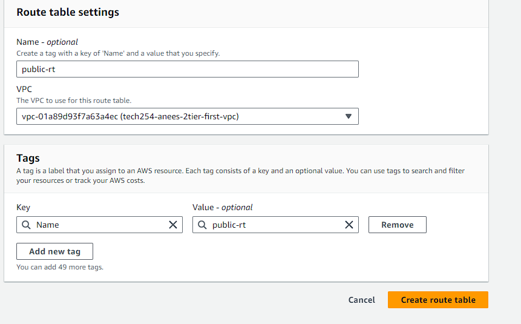
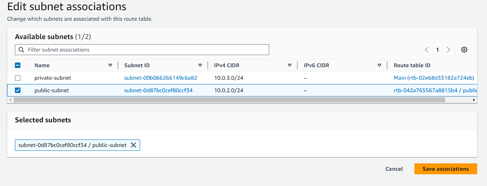
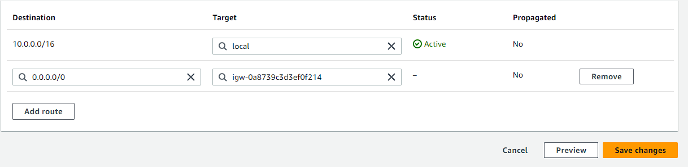
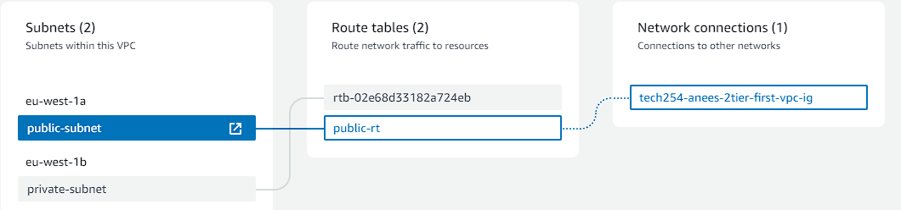
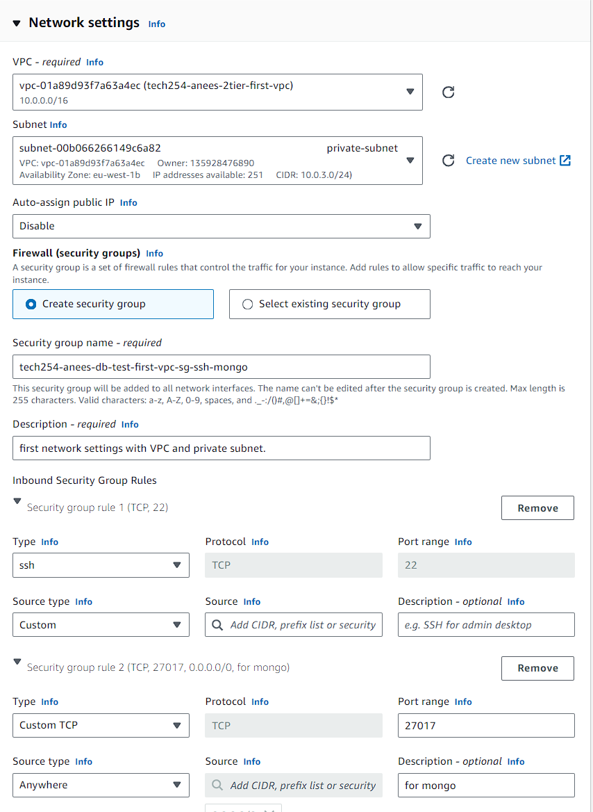
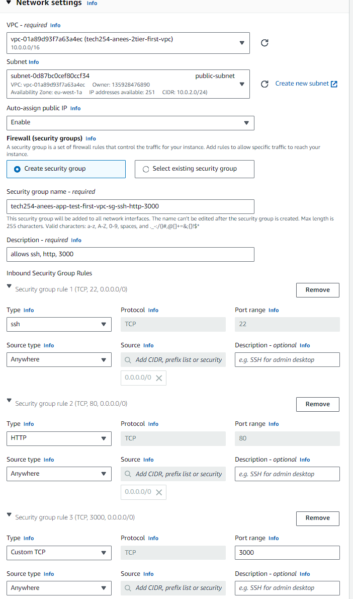

### VPC

A vpc uses an Internet gateway, acting as a door, and in this case, has two subnets within. A public subnet where we host our app, and a private subnet where he host our db.

Our ip addresses will be hosted with the ipv4 format, this means they'll have 32 bit addresses 
"10.0.3.0/24 --> only last 8 bits can be changed/used, which in this case is the 0 after the 3. They can be used as address space.
CIDR Block --> Range of I.P addresses

For an additional layer of security, apply network security groups to protect who can and cannot connect to our subnets.

### Routing

A Router will be set up to direct traffic and will use a Route table to decide where to send the traffic.

Internet gateway uses the public router and route table to direct the traffic to the public subnet, where they have to pass the network security groups which will then lead them to the app vm.

The app VM uses a public ip address where traffic is sent, and this public ip is the final destination, and is the website the user will see.

The App vm requests to database via a router which is using the default route table. The request is sent to the network security groups where, upon passing, is then directed to the DB vm. This is the private subnet.

Routing works in both directions, the database (private subnet) has no route to get to the outside - to the internet. There is only a route into the database.

NACL - This is another layer of security, we can set up custom rules to lets certain traffic to get in and out of subnet, once you pass the NACL you then are greeted by the network security group.


## Making a vpc

**Step 1:**

Navigate to the VPC console and select create VPC.

Here we have two options, select VPC only.

Name the vpc appropriately, and enter "10.0.0.0/16" for the IPv4 CIDR. This will allow us to configure our ipv4 for our subnets. 




**Step 2:**

Next we need to create a public and private subnet. Head to the subnet tab in the navigation pane and select create subnet.

Select the vpc we have just created in the drop down menu. The first subnet we will create is the public subnet and make sure to select zone 1a. For the IPv4 subnet CIDR block enter 10.0.2.0/24

Add a new subnet, calling it private subnet but in zone 1b. But this time the subnet CIDR block should be 10.0.3.0/24



 
**step 3:**

Next, go to Internet Gateway and create a new gateway.



Once created, go to the gateway we created, click actions and attach to VPC. Search for your vpc in the drop down menu.

**step 4: **

Go to Route table
Create a public route tables and make sure to select the correct vpc.




**step 5:**

association between route and subnet

subnet association - > edit

For the public route table associate to public subnet



**step 6:**

Go to route tab, and select edit route. Currently only allows local connections.
We need to add one for the final destination, which could be anywhere. 

For the target select internet gateway, and select your gateway from the drop down list.



**step7**

Check if it is working, go to your vpc. 
Resource map shows what is connected to your vpc.




### Set up db and app with subnet.

Find db ami and launch instance from ami. Use the usual settings.

For network settings choose the vpc we created, and select the private subnet. We must create a new security group for these new settings.

Add a new inbound rule to accept anywhere as a source type.



Find app ami and launch instance from ami. Use the usual settings. Create a new security group.

For network settings choose the vpc we created, and select the public subnet. Enable auto assign public ip. Assign ssh, http and port 300 for security group rules.




Start the app instance with the following user data.

```bash
#!/bin/bash

# set up connection to db via environment variable db_host
export DB_HOST=mongodb://10.0.3.217:27017/posts

# install app
cd /home/ubuntu/repo/app
npm install

# seed database
echo "Clearing and seeding database..."
node seeds/seed.js
echo " --> Done!"

# start the app
sudo npm install pm2 -g
pm2 kill
pm2 start app.js
```


### Notes on vpc
AWS is a building - we are sharing with everyone using the public cloud.

In every region, there is a default vpc = "shared flat".

Three rooms in shared flat - the subnets - the availability zones. Default subnet for each zone, and they're all public.

Custom vpc = separate flat. Use to keep things private.

With a custom vpc we can set our own security rules.

We can decided whether public or private subnets, also we can decide the zone.

We have 2 rooms with a custom vpc:
* public subnet - everyone can see - AZ 1a
* private subnet - AZ 1b.

The main reason is greater control over security.

On azure there is no default subnet, vpcs are virtual networks. So you need to set up all by scratch.